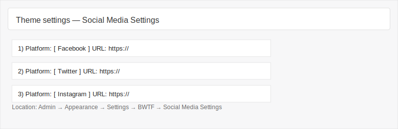

# BWTF Drupal Theme

Custom Drupal 11 theme for Ben's World of Transformers (BWTF).

## Features

### Configurable Slider
The theme includes a fully configurable homepage slider with:
- 6 customizable slides
- Image upload support (SVG, WebP, PNG, JPG, JPEG)
- Responsive image support with multiple aspect ratios (16:9 and 21:9)
- Configurable overlay styles (None, Solid, Gradient, Multiply)
- Autoplay settings with adjustable delay
- Title, description, URL, and link text for each slide

### Configurable Social Media Links (New!)
Added January 2026 - Dynamic social media configuration system.

#### Features
- **8 Configurable Slots**: Add up to 8 social media links
- **Platform Support**: 
  - Facebook
  - X (Twitter)
  - Instagram
  - YouTube
  - LinkedIn
  - TikTok
  - GitHub
  - Patreon
  - Custom (with generic link icon)
- **Font Awesome Icons**: Uses Font Awesome 6 Free for modern, scalable icons
- **Dynamic Display**: Only populated slots are displayed
- **Reusable Block**: Available as a block plugin for placement in any region
- **Accessible**: Includes proper ARIA labels and semantic HTML

#### Files Modified

**1. bwtf.libraries.yml**
- Added Font Awesome 6 Free CDN library
- Added `social-links` library that depends on Font Awesome

**2. bwtf.theme**
- Registered `social` theme hook via `hook_theme()`
- Added `bwtf_get_social_links()` helper function to process social media config
- Extended `bwtf_preprocess_page()` to expose `social_links` variable to all templates

**3. theme-settings.php**
- Added "Social Media Settings" section with 8 configurable slots
- Each slot has platform selector and URL field with validation
- Extended submit handler to save social media configuration to `bwtf.settings`

**4. templates/components/social.html.twig**
- Replaced hardcoded links with dynamic loop over `social_links` variable
- Uses Font Awesome `<i>` tags instead of image files
- Added proper accessibility attributes (`aria-label`, `rel="noopener noreferrer"`)
- Only displays when social links are configured

**5. templates/layout/footer.html.twig**
- Replaced hardcoded social links with dynamic rendering
- Uses Font Awesome icons
- Attaches social-links library

**6. src/Plugin/Block/SocialMediaBlock.php** (New File)
- Custom block plugin for placing social links in any region
- Uses the same `bwtf_get_social_links()` helper and `social` template
- Can be placed via Block Layout UI at `/admin/structure/block`
- Includes proper cache tags for configuration

#### Configuration

##### Via Theme Settings
1. Navigate to `/admin/appearance/settings/bwtf`
2. Scroll to "Social Media Settings" section
3. For each slot (1-8):
   - Select a platform from the dropdown
   - Enter the complete URL (e.g., `https://facebook.com/yourpage`)
4. Click "Save configuration"
5. Only slots with both platform and URL populated will display

##### Via Block Placement (Optional)
1. Navigate to `/admin/structure/block`
2. Click "Place block" in desired region
3. Search for "Social Media Links"
4. Place and configure the block
5. The block reads from the same theme settings configuration

#### Examples

1) Place the block via the Block Layout UI

- Go to `/admin/structure/block` and click "Place block" in the region you want the icons to appear.
- Search for `Social Media Links`, click "Place block", adjust visibility and title settings (if desired), then save.

2) Render the social component directly in a Twig template

The theme exposes a `social` component template. If you need to include the social links directly from a Twig file (for example in a custom region template), you can include the component and pass the `social_links` array:

```twig
{# Include the theme component from the bwtf theme namespace #}
{{ include('@bwtf/components/social.html.twig', { 'social_links': social_links }) }}
```

Note: `social_links` is already exposed to all page templates by `bwtf_preprocess_page()`. If you want to pass a custom set of links, provide an array with the same shape (see "Data shape" below).

3) Admin UI screenshot (placeholder)

Below is a small placeholder screenshot of the Theme Settings page location for the Social Media Settings. Replace or update the file at `assets/imgs/admin-social-settings.svg` with a real screenshot if desired.



#### Technical Details

**Icon Mapping**
```php
$icon_map = [
  'facebook' => 'fa-brands fa-facebook',
  'x-twitter' => 'fa-brands fa-x-twitter',
  'instagram' => 'fa-brands fa-instagram',
  'youtube' => 'fa-brands fa-youtube',
  'linkedin' => 'fa-brands fa-linkedin',
  'tiktok' => 'fa-brands fa-tiktok',
  'github' => 'fa-brands fa-github',
  'patreon' => 'fa-brands fa-patreon',
  'custom' => 'fa-solid fa-link',
];
```

**Configuration Storage**
Social media settings are stored in `bwtf.settings` config object:
- `social1_platform`, `social1_url`
- `social2_platform`, `social2_url`
- ... (up to `social8_platform`, `social8_url`)

**Template Variables**
The `social_links` array is available in all page templates with the following structure:
```php
[
  [
    'platform' => 'facebook',
    'url' => 'https://facebook.com/example',
    'label' => 'Facebook',
    'icon' => 'fa-brands fa-facebook',
  ],
  // ... additional links
]
```

#### Customization

**Styling**
The social links use existing `.footer-social` CSS classes. Font Awesome icons can be styled using standard CSS:
```css
.footer-social i {
  font-size: 1.5rem;
  color: #fff;
}
```

**Adding More Platforms**
To add more platform options:
1. Edit `theme-settings.php` - Add platform to `$platform_options` array
2. Edit `bwtf.theme` - Add icon mapping in `bwtf_get_social_links()` function
3. Clear cache

**Changing Icon Library**
Currently uses Font Awesome 6 Free CDN. To use a different version or self-hosted:
1. Edit `bwtf.libraries.yml` - Update the CDN URL or add local files
2. Clear cache

## Theme Architecture

**Pattern: Fixed Slots**
Both slider and social media use a "fixed slots" pattern (inspired by common Drupal theming practices):
- Slider: 6 fixed slots
- Social Media: 8 fixed slots
- Empty slots are automatically filtered out during preprocessing
- No Ajax or complex form rebuilding required
- Simple, reliable, and sufficient for most use cases

**Preprocessing Flow**
1. Configuration stored in `bwtf.settings` config object
2. Helper function (`bwtf_get_social_links()`) loads and processes config
3. Preprocessing hook (`bwtf_preprocess_page()`) exposes variables to templates
4. Templates render dynamic content
5. Block plugin can reuse the same helper function

## Development

### Clearing Cache
After making theme changes:
```bash
drush cr
```

Or via UI: `/admin/config/development/performance`

### File Structure
```
web/themes/custom/bwtf/
├── assets/
│   ├── css/
│   ├── js/
│   └── imgs/
├── src/
│   └── Plugin/
│       └── Block/
│           └── SocialMediaBlock.php
├── templates/
│   ├── components/
│   │   ├── slider.html.twig
│   │   ├── social.html.twig
│   │   └── simpleads.html.twig
│   └── layout/
│       ├── footer.html.twig
│       ├── header.html.twig
│       ├── page.html.twig
│       └── sidebar.html.twig
├── bwtf.info.yml
├── bwtf.libraries.yml
├── bwtf.theme
├── theme-settings.php
└── README.md
```

## Credits

- Theme Development: Dave Carter - [dcartdevelopment.com](https://www.dcartdevelopment.com)
- Social Media Configuration: Implemented January 2026
- Font Awesome Icons: [Font Awesome 6 Free](https://fontawesome.com/)
- Slider Library: [Swiper.js](https://swiperjs.com/)
